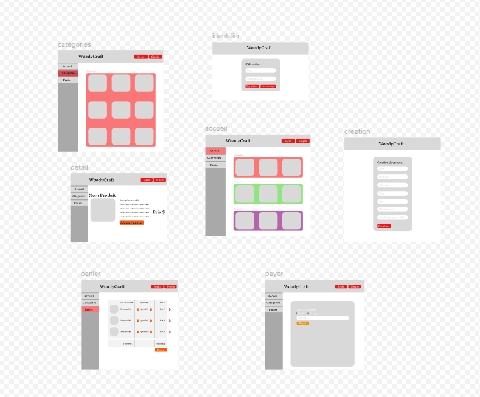
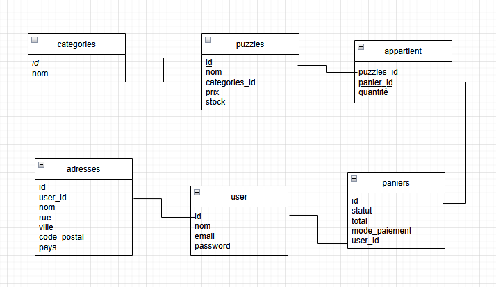

# Livrable

## Presentation du besoin metier 

###  1 Objectif

La société WoodyCraft fait de la vente en ligne de puzzles 3D. Elle nous as sollicité pour la création de leur site d’e-commerce. Nous allons donc devoir créer les fonctionnalités de base d’un panier.

## 2 Fonctionnalités attendues

- Visualiser la liste des catégories sur la page d’accueil  
- Visualiser la liste des produits par catégorie 
- Visualiser les détails d’un produit 
- Ajouter un produit au panier depuis la page produit 
- Modifier la quantité d’un produit du panier 
- Supprimer un produit du panier 
- Se connecter 
- Passer commande 
- Saisir ou modifier l’adresse de livraison 
- Si l’utilisateur a déjà passé commande, l’adresse utilisée lors de cette première commande 
devra être reprise par défaut pour toute nouvelle commande (il pourra alors la modifier)
- La connexion est obligatoire pour passer commande 
- Le paiement s’effectue par Paypal ou chèque 
- Si l’utiisateur choisit le paiement par chèque, un PDF est généré, avec le détail de la
facture (liste des produits + montant total) ainsi que l’adresse à laquelle il doit envoyer
le chèque 
- Si l’utiisateur choisit Paypal, il est redirigé vers la page https://www.paypal.com/fr/home/ 

## 3 Exemples de fonctionnalités supplémentaires

- Paiement par Carte bancaire
- Version multilingue de l’application
- Ajouter une quantité précise d’un produit au panier
- Créer une partie "Administration" du site
- Afficher les produits similaires sur la page d’un produit
- Ajouter un produit au panier depuis la liste des produits

## Présentation de l’architecture matérielle

## Modélisation UML

## Maquette

[lien vers la maquette](https://www.figma.com/design/PpIzk68sGOOFEoVnMWAAYj/Untitled?node-id=0-1&p=f&t=Z4tGSJWuTOd3xONE-0)

## Modélisation de la base de données

## Procédure d’intégration

## Rapport de tests 

## Procedure de déploiment