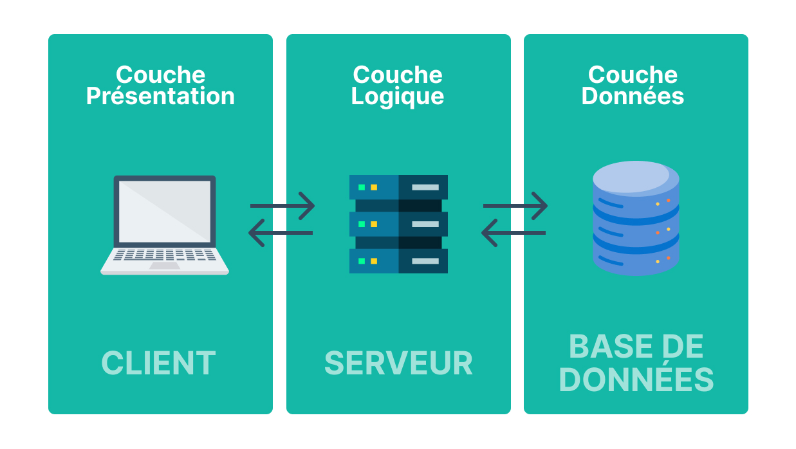
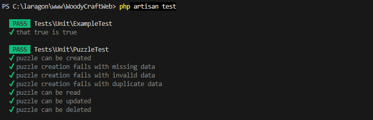

# Livrable


## Presentation du besoin metier 

###  1 Objectif

La société WoodyCraft fait de la vente en ligne de puzzles 3D. Elle nous as sollicité pour la création de leur site d’e-commerce. Nous allons donc devoir créer les fonctionnalités de base d’un panier.

### 2 Fonctionnalités attendues

- Visualiser la liste des catégories sur la page d’accueil </br>
- Visualiser la liste des produits par catégorie</br>
- Visualiser les détails d’un produit</br>
- Ajouter un produit au panier depuis la page produit</br>
- Modifier la quantité d’un produit du panier</br>
- Supprimer un produit du panier</br>
- Se connecter</br>
- Passer commande</br>
- Saisir ou modifier l’adresse de livraison</br>
- Si l’utilisateur a déjà passé commande, l’adresse utilisée lors de cette première commande</br>
devra être reprise par défaut pour toute nouvelle commande (il pourra alors la modifier)
- La connexion est obligatoire pour passer commande</br>
- Le paiement s’effectue par Paypal ou chèque</br>
- Si l’utiisateur choisit le paiement par chèque, un PDF est généré, avec le détail de la
facture (liste des produits + montant total) ainsi que l’adresse à laquelle il doit envoyer
le chèque</br>
- Si l’utiisateur choisit Paypal, il est redirigé vers la page https://www.paypal.com/fr/home/</br>

#### Paiement par chèque
- Génération d’un PDF contenant le détail de la facture (produits + montant total)  
- Indication de l’adresse d’envoi du chèque  

#### Paiement via PayPal
- Redirection vers : https://www.paypal.com/fr/home/  


### 3. Fonctionnalités supplémentaires (optionnelles)

- Paiement par carte bancaire  
- Version multilingue du site  
- Ajout d’une quantité personnalisée depuis la fiche produit  
- Mise en place d’un espace d’administration  
- Suggestion de produits similaires  
- Ajout au panier directement depuis la liste des produits  

---

## Présentation de l’architecture matérielle

Pour la réalisation de ce projet, nous avons dû réaliser une architecture 3 tiers.



Premièrement, le site web est hébergé sur le serveur, ensuite les données sont enregistrées dans le serveur de base de données grâce à PHPMyadmin et pour finir l'utilisateur peut interagir avec la base de données grâce à l'interface web.

## Modélisation UML


## Maquette


[lien vers la maquette](https://www.figma.com/design/PpIzk68sGOOFEoVnMWAAYj/Untitled?node-id=0-1&p=f&t=Z4tGSJWuTOd3xONE-0)

## Modélisation de la base de données


## Rapport de tests 

Différents tests ont été réalisés pour les données, pour cela on a créé des données fictives pour tester les différentes fonctionnalités.
<br>Pour cela il faut d'abord crée le fichier de test avec la comande:

```bash
php artisan make:factory PuzzleFactory --model=Puzzle
```
Ensuite dans ce fichier crée, il faut renseigner les bons champs de notre table.

```php
class PuzzleFactory extends Factory
{
    protected $model = Puzzle::class;

    public function definition()
    {
        return [
            'nom'          => $this->faker->word,
            'categorie_id' => Categorie::factory(),
            'description'  => $this->faker->sentence,
            'prix'         => $this->faker->randomFloat(2, 1, 99),
            'image'        => 'test_image.png',
            'stock'        => $this->faker->numberBetween(1, 99),
        ];
    }
}
```
Pour finir, il faut créer le fichier de test pour pouvoir effectuer les différentes fonctionnalités implémentées comme l'insertion, la modification, etc...
<br> pour cela on utilise la commande:

```bash
php artisan make:test PuzzleTest --unit
```
Dans ce fichier, on a implémenté les tests à réaliser, ici on peut voir en détail le test de la création des puzzles.
```php
public function test_puzzle_can_be_created()
    {
        $puzzle = Puzzle::factory()->create([
            'nom'          => 'Test Puzzle',
            'categorie_id' => $this->getCategorieId(),
            'description'  => 'Ceci est un puzzle de test.',
            'prix'         => 9.99,
            'image'        => 'test_image.png',
        ]);

        $this->assertDatabaseHas('puzzles', ['nom' => 'Test Puzzle']);
    }
```

Pour finir, il faut s'assurer que les tests ont été correctement effectués, pour cela on utilise la commande:

```bash
php artisan test
```
Si tous les tests ont réussi, on devrait obtenir quelque chose comme ça:



On peut voir ici que les tests de création, de lectures, de mise à jour et de suppression ont été effectués.
Il y a aussi des tests d'insertion de données incorrects comme avec les tests de données manquantes, invalides et la duplication de données.